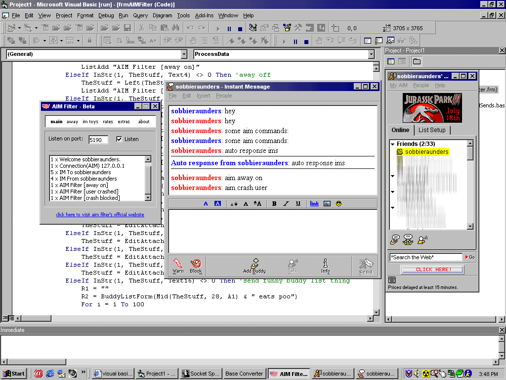



## AIM Filter \(Local Proxy\)

### Description

*Please read readme.txt to learn how to use it* Do you like your current AIM client, but wish you had some cool new features your friends don't? This easy to configure program will process your AIM data and do things you normally couldn't do (send IM's while away, crash users, talk in auto responses, send fake files, just to name a few). I never go on AIM without it! Notes: Uses AIM's newer protocol (OSCAR) not TIC/TOC
 
### More Info
 

             |
---                |---
**Submitted On**   |2001-07-16 16:11:40
**By**             |[Robbie Saunders](https://github.com/Planet-Source-Code/PSCIndex/blob/master/ByAuthor/robbie-saunders.md)
**Level**          |Advanced
**User Rating**    |3.7 (11 globes from 3 users)
**Compatibility**  |VB 6\.0
**Category**       |[Complete Applications](https://github.com/Planet-Source-Code/PSCIndex/blob/master/ByCategory/complete-applications__1-27.md)
**World**          |[Visual Basic](https://github.com/Planet-Source-Code/PSCIndex/blob/master/ByWorld/visual-basic.md)
**Archive File**   |[AIM Filter228987162001\.zip](https://github.com/Planet-Source-Code/robbie-saunders-aim-filter-local-proxy__1-25089/archive/master.zip)

